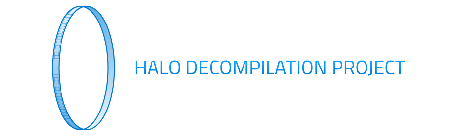

The goal of this project is to study and create a free, open-source re-implementation of the original Xbox launch title [Halo: Combat Evolved](https://en.wikipedia.org/wiki/Halo:_Combat_Evolved).

**Disclaimer:** This project is intended only for educational and research purposes, and is not indended to promote piracy or violation of any copyright laws. This repository does not include original game executables, nor does it include required game assets. You will need to provide these files from your own copy of the game. Buy a copy. Heck, buy two!

**Motivation:** Fans of Halo CE will be empowered to customize and enjoy this incredible classic in new ways, to understand the mechanics behind the game, and to eventually achieve interoperability of their copy of the game with more of their personal devices. Moreover, this project serves as an exciting vehicle to drive advancements in program analysis research and tooling.

**Methodology:** Pieces of the game are slowly being re-implemented in C source code. These re-implemented pieces are then compiled and patched into the original executable, such that the re-implemented pieces are used instead of their original implementation counterparts. This approach enables incremental development, testing, and debugging.

Community
---------
The homepage for this project is: https://blam.info/

There is a Discord server for the project: https://discord.gg/wJFfe6c9UB

Current State
-------------
* Able to patch and run existing game
* Main loop of the game is re-implemented
* Several more functions are implemented
* Long way to go...

The [Progress Report](https://blam.info/progress/) details what functionality has re-implemented.

Build
-----
You can build with Visual Studio or clang, on Windows/macOS/Linux. You'll also need Python 3.

* First prepare `halo-patched` directory with disc files and original executable
  * Retail disc game files
  * Original executable version `01.10.12.2276` (MD5: `c7869590a1c64ad034e49a5ee0c02465`) as file `cachebeta.xbe`
* You can build in a Docker container, or outside of a container with system tools (e.g. clang, MSVC).
* If not using a container to build, install system deps:
  * Ensure Python 3 is installed.
  * On Windows you can use Visual Studio (MSVC).
  * On Linux/macOS/WSL you can use clang:

### Build options

Build with the Docker container:
```
docker build -t halo .
docker run -it --rm  -u $(id -u):$(id -g) -v $PWD:/work -w /work halo /bin/bash -c "cmake -Bbuild -S. -DCMAKE_TOOLCHAIN_FILE=toolchains/llvm.cmake && cmake --build build"
```

Build on Windows with CMake and Visual Studio:
```
python3 -m pip install --user -r requirements.txt
cmake -AWin32 -Bbuild -S.
cmake --build build
```

Build on Linux (Ubuntu) with CMake and clang:
```
sudo apt install cmake clang lld python3-pip
python3 -m pip install --user -r requirements.txt
cmake -Bbuild -S. -DCMAKE_TOOLCHAIN_FILE=toolchains/llvm.cmake
cmake --build build
```

Build on macOS (works on both Intel and Apple Silicon macs) with CMake and clang:
```
brew install llvm cmake
python3 -m pip install --user -r requirements.txt
export PATH="/opt/homebrew/opt/llvm/bin:/usr/local/opt/llvm/bin:$PATH"
cmake -Bbuild -S. -DCMAKE_TOOLCHAIN_FILE=$PWD/toolchains/llvm.cmake
cmake --build build --target halo
```

When the build is complete, the original game with re-implementation patched in will be at `halo-patched/default.xbe`. Use `extract-xiso` to create an ISO from your `halo-patched` directory, then run `halo-patched.iso` in xemu, or on your Xbox.

You'll want to set up a debug environment.

Reversing
---------
Interested in reversing the game? PRs are welcome!

The process of adding re-implemented functions is mostly automated and relatively painless:
* Add new function/data declarations to `kb.json` as they are discovered and confirmed. The definitions in `kb.json` are used to automatically generate header files and link the new implementation with the original XBE.
* Implement new functions in the appropriate source file `src/halo/**/*.c`. Add new source files to `src/CMakeLists.txt`.
* The build system will compile and patch the XBE with redirects from the original implementations to the re-implementations.
* Naturally, your new code will call some function in the original binary that has not yet been re-implemented. These functions will also be automatically linked correctly, provided the definitions of data and called functions are in `kb.json`.

See the [Progress Report](https://blam.info/progress/) to interactively explore the call graph, familiarize yourself with the code base, and examine the project frontier.
